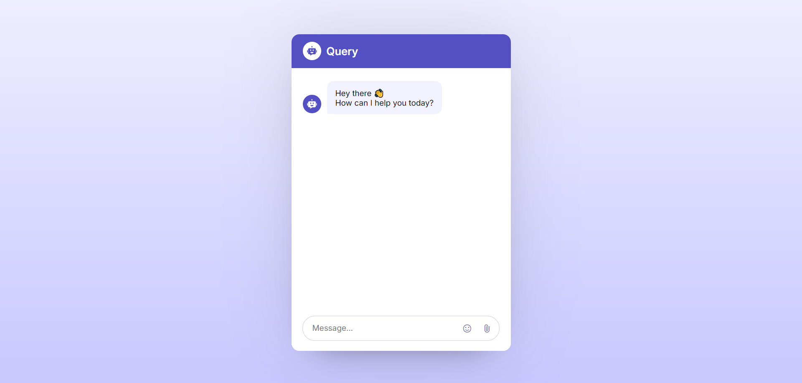
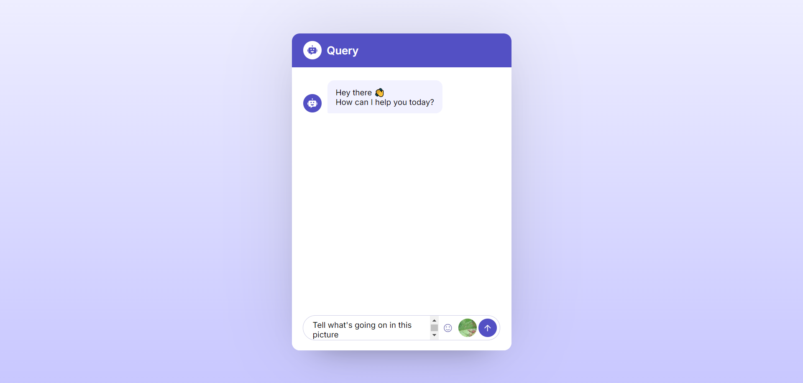
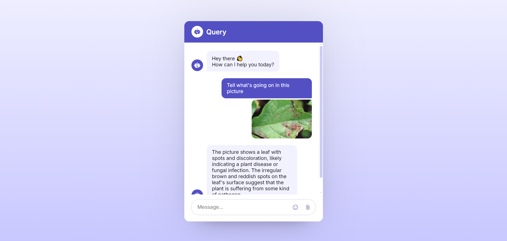

# 🤖 Query The Chatbot - AI Chatbot Interface

A modern, responsive, and multimodal AI chatbot interface built with Vanilla JavaScript, HTML, and CSS. This project features a clean UI that supports text interactions, image uploads for multimodal analysis, and emoji integration, connected specifically to a serverless backend (Netlify Functions).

## 📸 Screenshots

| **Chatbot Interface** | **Multimodal Input** | **AI Response** |
|:---:|:---:|:---:|
|  |  |  |
| *Clean UI layout* | *User uploading file* | *Bot analyzing image* |

## ✨ Features

  * **Multimodal Support:** Users can upload images along with text prompts to analyze visual data.
  * **Smart UI/UX:**
      * Auto-expanding chat window.
      * "Thinking" indicator while waiting for API responses.
      * Auto-scrolling to the latest message.
  * **Emoji Support:** Integrated **Emoji Mart** picker for expressive messaging.
  * **Markdown Formatting:** Basic parsing to render bold text from the AI response.
  * **Responsive Design:** Optimized for desktop and mobile views.
  * **Serverless Architecture:** Configured to communicate via Netlify Functions to keep API keys secure.

## 🛠️ Tech Stack

  * **Frontend:** HTML5, CSS3
  * **Scripting:** Vanilla JavaScript (ES6+)
  * **Icons:** Google Material Symbols
  * **Libraries:** [Emoji Mart](https://github.com/missive/emoji-mart) (via CDN)
  * **API Integration:** Fetch API targeting a Netlify Serverless Function.

## 🚀 Installation & Setup

To run this project locally, you will need to set up the frontend and a local server environment to handle the serverless function calls.

### 1\. Clone the repository

```bash
git clone https://github.com/Otormin/QueryTheChatbot.git
cd your-repo-name
```

### 2\. Backend Configuration

This project interacts with `/.netlify/functions/chat`. You need a backend function to handle the API request to the AI provider (e.g., Google Gemini).

1.  Ensure you have the [Netlify CLI](https://docs.netlify.com/cli/get-started/) installed:
    ```bash
    npm install netlify-cli -g
    ```
2.  Create a folder named `netlify/functions` in your root directory.
3.  Add your backend logic file (e.g., `chat.js`) inside that folder to handle the API keys and request forwarding.

### 3\. Running Locally

Using Netlify Dev to proxy the functions:

```bash
netlify dev
```

This will start a local server (usually at `localhost:8888`) where the frontend can successfully communicate with the backend function.

## 📂 Project Structure

```text
├── index.html       # Main application structure
├── Index.css        # Styling and layout
├── script.js        # DOM manipulation and API logic
├── netlify/
│   └── functions/
│       └── chat.js  # Serverless function (Backend logic)
└── README.md        # Documentation
```
-----